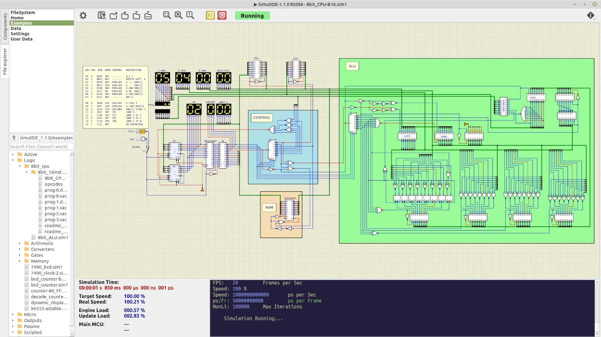

<div align="center">



# SimulIDE for FreeBSD

### SimulIDE 1.1.0-SR2 · Native FreeBSD Packaging & Desktop Integration

<p>
  
  
  
  
  
</p>

<p>
  <strong>A community FreeBSD packaging effort for SimulIDE 1.1.0-SR2.</strong><br>
  Developed and tested directly on real FreeBSD hardware.
</p>

</div>

---

## About

**SimulIDE for FreeBSD** is an independent community project focused on bringing **SimulIDE 1.1.0-SR2** into a clean, native FreeBSD installation model.

The project began with a simple objective:

> Take a working native FreeBSD build of SimulIDE and turn it into a properly integrated FreeBSD package.

The result is an installation managed by the native FreeBSD package ecosystem, with Qt dependencies resolved by `pkg`, application data placed in the standard filesystem hierarchy, and desktop integration provided through XDG application and icon infrastructure.

This work was carried out by **AnOnYmOuS**, with development, debugging, reverse-engineering of the build system and packaging assistance from **ChatGPT**.

This repository is **not affiliated with or maintained by the official SimulIDE project**.

---

## What has been achieved

The project went beyond simply compiling an executable.

The development process covered the complete path from source code to a functioning desktop application:

```text
SimulIDE 1.1.0-SR2 source
            │
            ▼
   Native FreeBSD build
            │
            ▼
 FreeBSD compatibility fixes
            │
            ▼
    Runtime validation
            │
            ▼
      FreeBSD Port
            │
      ┌─────┴─────┐
      ▼           ▼
   Qt 5         Runtime
dependencies     data
      │           │
      └─────┬─────┘
            ▼
     FreeBSD .pkg
            │
            ▼
   Desktop integration
            │
            ▼
       SimulIDE
```

The resulting package includes:

* the SimulIDE executable;
* the complete runtime `data` tree;
* the bundled examples;
* Qt 5 runtime dependencies;
* an XDG `.desktop` entry;
* a dedicated application icon;
* desktop and icon-cache integration;
* standard FreeBSD `/usr/local` installation paths.

---

## Download & Install

### Binary package

A pre-built FreeBSD package is available from the project's GitHub Releases:

**[Download SimulIDE 1.1.0-SR2 for FreeBSD amd64](https://github.com/EvonyMaster/SimulIDE-FreeBSD/releases/latest/download/simulide-1.1.0.pkg)**

The package is intended for:

```text
FreeBSD 15.x
amd64
```

Install the downloaded package with:

```sh
sudo pkg install ./simulide-1.1.0.pkg
```

`pkg` will resolve the required Qt 5 runtime dependencies automatically.

### Build from source

The FreeBSD Port is also included in this repository:

```sh
cd freebsd/ports/simulide
make package
```

The generated package will be available at:

```text
work/pkg/simulide-1.1.0.pkg
```

This project therefore provides both a **ready-to-install package** and the **FreeBSD packaging infrastructure used to build it**.

> The direct download link becomes active once the package is published as an asset of the latest GitHub Release.


## Installation

Build the package from the FreeBSD Port:

```sh
cd freebsd/ports/simulide
make package
```

The generated package is:

```text
work/pkg/simulide-1.1.0.pkg
```

Install it with:

```sh
sudo pkg install ./work/pkg/simulide-1.1.0.pkg
```

After installation, SimulIDE is available as:

```text
/usr/local/bin/simulide
```

The application can also be launched from a graphical application menu or Rofi.

---

## Installed layout

The package follows the conventional FreeBSD `/usr/local` hierarchy:

```text
/usr/local/bin/simulide
/usr/local/share/simulide/
├── data/
└── examples/

/usr/local/share/applications/simulide.desktop

/usr/local/share/icons/hicolor/scalable/apps/simulide.svg
```

This allows SimulIDE to behave like a normal installed FreeBSD desktop application rather than an unpacked application directory.

---

## Qt integration

The package does **not** ship private copies of Qt.

Instead, the Port declares the required Qt 5 components and lets FreeBSD's package manager resolve them:

```text
qt5-core
qt5-gui
qt5-widgets
qt5-xml
qt5-concurrent
qt5-network
qt5-svg
qt5-multimedia
qt5-serialport
```

This approach keeps the application integrated with the host system and avoids duplicating system libraries inside the application package.

---

## The road to the port

The first stage was simply getting SimulIDE to compile and run correctly on FreeBSD.

Once the native build was functional, the work moved into understanding how SimulIDE determines its runtime directories, how its Qt project installs resources, and how FreeBSD expects desktop software to be packaged.

One particularly important discovery was SimulIDE's runtime path handling.

The application determines its executable directory and checks for:

```text
../share/simulide
```

That makes the following FreeBSD layout a natural fit:

```text
/usr/local/bin/simulide
/usr/local/share/simulide
```

No invasive modification of the application's runtime directory model was therefore necessary.

The packaging work then introduced:

* FreeBSD Port metadata;
* Qt dependency declarations;
* staged installation;
* package file validation;
* desktop integration;
* application icon integration;
* automatic packaging of the SimulIDE data and example trees.

The Port was repeatedly validated with:

```sh
make stage
make check-plist
make package
```

The final package was then installed on the development machine using `pkg` and launched directly from `/usr/local/bin/simulide`.

---

## FreeBSD-specific work

This project also documents the FreeBSD-specific compatibility work required to get SimulIDE 1.1.0-SR2 working reliably.

During development, the original build encountered compatibility issues in the **AngelScript** component.

Those issues were investigated directly against the FreeBSD source/build environment and corrected until the application built and ran successfully.

The repository therefore contains not only packaging metadata, but also the source tree used to reproduce the working FreeBSD build.

---

## Development hardware

This port was developed on a real **Apple MacBook Pro A1278 / MacBookPro9,2**, rather than in a generic virtual machine.

| Component           | Specification           |
| ------------------- | ----------------------- |
| Machine             | Apple MacBook Pro A1278 |
| Model               | MacBookPro9,2           |
| Display             | 13-inch                 |
| Year                | Mid-2012                |
| CPU                 | Intel Core i7-3520M     |
| Frequency           | 2.9 GHz                 |
| CPU topology        | 2 cores / 4 threads     |
| RAM                 | 16 GB DDR3              |
| Memory              | Dual-channel            |
| Storage             | Kingston 480 GB SSD     |
| GPU                 | Intel HD Graphics 4000  |
| Operating system    | FreeBSD 15.1 amd64      |
| GUI toolkit         | Qt 5                    |
| Desktop integration | XDG / X11               |

The machine itself is part of the project's story: an almost fifteen-year-old Intel MacBook was used as the actual development and validation platform for the FreeBSD packaging work.

---

## Repository structure

```text
SimulIDE-FreeBSD/
│
├── assets/
│   └── simulide.webp
│
├── freebsd/
│   └── ports/
│       └── simulide/
│           ├── files/
│           │   ├── simulide.desktop
│           │   └── simulide.svg
│           ├── Makefile
│           └── pkg-descr
│
├── resources/
├── src/
│
├── COPYING
├── LICENSE-BSD-3-Clause.txt
├── README.md
├── SimulIDE.pro
└── copyright.txt
```

---

## Current packaging model

The current Port intentionally concentrates on **packaging and integration around the already validated FreeBSD build**.

At this stage, the Port uses the SimulIDE executable produced during development rather than downloading and rebuilding the complete upstream source tree from a remote distfile.

That distinction is intentional and documented.

### Current workflow

```text
Source tree
    │
    ├── Native FreeBSD build
    │
    └── Validated executable
              │
              ▼
        FreeBSD Port
              │
              ▼
        pkg package
```

### Future direction

A future iteration can move toward a fully source-driven FreeBSD Port in which a clean checkout fetches the appropriate upstream source archive, applies the FreeBSD compatibility patch set, builds SimulIDE and produces the package without relying on a pre-existing development build.

The current repository provides the foundation for that evolution.

---

## Verification

The final package was validated on the development system.

The resulting package size was approximately:

```text
4.5 MB
```

The package was successfully installed with:

```sh
sudo pkg install ./work/pkg/simulide-1.1.0.pkg
```

The installed application was verified at:

```text
/usr/local/bin/simulide
```

SimulIDE successfully loaded its runtime environment from:

```text
/usr/local/share/simulide/data
```

including its component definitions, compilers, assemblers and other runtime resources.

---

## Credits

### SimulIDE

Many thanks to the **SimulIDE developers and contributors** for creating and maintaining an excellent open-source electronic circuit simulator and MCU development environment.

Without the original SimulIDE project, this FreeBSD port would not exist.

### FreeBSD

Special thanks to the **FreeBSD Project**, its developers, porters and contributors for the operating system, Ports Collection and packaging infrastructure that made this work possible.

FreeBSD's packaging model provided the foundation for turning the working build into a proper system-integrated application.

### The people behind this port

**FreeBSD port and packaging:**
**AnOnYmOuS**

**Development, debugging and packaging assistance:**
**ChatGPT**

This project represents a practical collaboration between a human developer working directly on the target hardware and an AI development assistant.

---

## Licensing

This repository contains work originating from two different licensing contexts.

### SimulIDE

The original SimulIDE source code is distributed under the:

**GNU Affero General Public License v3.0 (AGPL-3.0)**

The original license is preserved in:

```text
COPYING
```

The upstream SimulIDE source is not relicensed by this repository.

### FreeBSD packaging and integration

The original packaging and integration work contributed to this repository is released under:

**BSD 3-Clause License**

See:

```text
LICENSE-BSD-3-Clause.txt
```

The two licenses are intentionally kept separate.

This repository therefore does **not** claim that the original SimulIDE source has been relicensed under BSD.

---

## Acknowledgements

This project would not have been possible without the work of the communities behind the software it builds upon.

**To the SimulIDE team:** thank you for the simulator, the source code and the many years of work behind it.

**To the FreeBSD community:** thank you for building an operating system and packaging ecosystem where projects like this can be explored, adapted and shared.

**To open-source contributors everywhere:** this repository is another small example of what becomes possible when existing software, documentation, operating systems and development tools are available for people to study and build upon.

---

<div align="center">

### Proudly Built on FreeBSD.

### Developed on real hardware.

### Powered by open source.

<br>

**SimulIDE 1.1.0-SR2 · FreeBSD**

</div>

